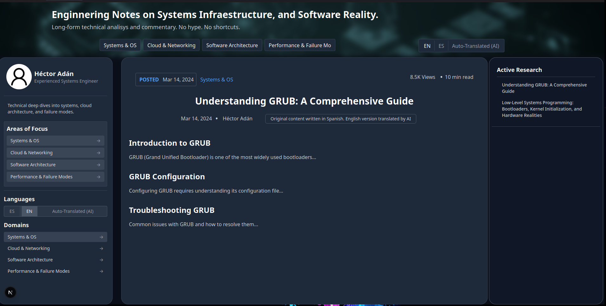

## Web application to deploy all yours articles, blogs, and so on.

**Note**: This project is currenly in a development phase, if you want to
contribute it, please make a pull request.

### Technologies
- **Front-end**
    - React Native
    - TailWind
    - shadcn/ui for components

    - Next JS (*AS META-FRAMEWORK*)

- **Back-end**
    - FastAPI
    - Pandoc

### Context

The main objetiv of this short project is to create an aplication to deploy
some of your homeworks, articles or opinions using a beautiful interface.

Just you need to upload LaTeX file (preference this kind of files) and that's all, 
you can see them on a web page because they were renderized on your navigator.

### 
*Here you are an example!*

